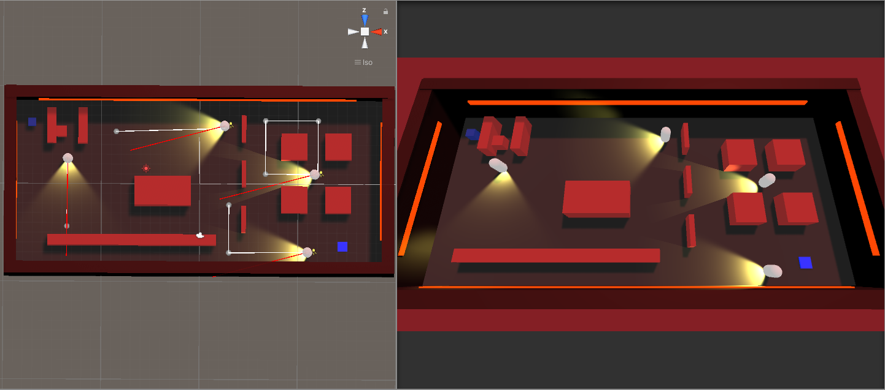

# Stealth-Game
2.5D video game
 
------------------------------------------------------------------------------------------------------------------------------------------
## How to play?

- Open `Build` folder and start `Keep-To-The-Shadows.exe`

- Must collect all 6 coins before touching the finish tile

- Reach the blue finish tile without being seen by the Guards and their Spotlight

- Use `WASD` or `arrow keys` for movement

- To exit or pause the game press `Esc`

This game was made in **Unity**.

Based on tutorial series found here: https://www.youtube.com/playlist?list=PLFt_AvWsXl0fnA91TcmkRyhhixX9CO3Lw

## Added

- Time tracking, saving the best time of the session 
- Coin collecting, needing to collect all of the coins before completion
- Pause menu, choosing between resuming and quitting the game
- Sound effects
- Alarm, flickering lights on walls and models
- Custom models
- Camera follows the player
